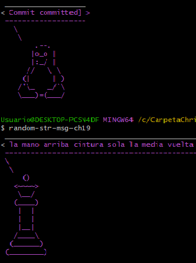

<!-- Please update value in the {}  -->

<h1 align="center">Random-str-msg-ch19</h1>


<div align="center">
  <h3>
    <a href="https://www.npmjs.com/package/random-str-msg-ch19">
      Package
    </a>
    <span> | </span>
    <a href="https://github.com/CH19/random-str-msg-ch19">
      Repository
    </a>
    <span> | </span>

  </h3>
</div>

<!-- TABLE OF CONTENTS -->

## Table of Contents

- [Table of Contents](#table-of-contents)
- [Instalation](#instalation)
- [Usage](#usage)
- [Overview](#overview)
  - [Built With](#built-with)
- [Acknowledgements](#acknowledgements)
- [Contact](#contact)

<!-- OVERVIEW -->

## Instalation 
you need first install npm in your computer or a node.js version above the 18 

next. in your terminal

```npm ```

```npm install```

```npm install -g random-str-msg-ch19```

## Usage

```random-str-msg-ch19```


## Overview




- Este proyecto es un despliegue de paquete en npm que genera strings random a partir de una data suministrada, de puede utilizar el comando con el que tiene el nombre del proyecto ````random-str-msj-ch19``` para le generacion de Strings
- Al desarrollar este pryecto pude mejorar mis habilidades en con la herramienta de npm, comprendiendo su ecosistema sobre como crear un **package.json**, las funcionales detrás de el, scripts de npm, los principales comando del ecosistema de **npm** y **npx**, distribuirlos, modificarlos, eliminarlos, crear nuevas versiones y vincularlos con github
- Me esta encanto este proyecto porque me pudo demostrar mi primer paso en 

### Built With

<!-- This section should list any major frameworks that you built your project using. Here are a few examples.-->

npm, package.json, node.js, JavaScript


## Acknowledgements

<!-- This section should list any articles or add-ons/plugins that helps you to complete the project. This is optional but it will help you in the future. For exmpale -->

- [Curso NPM](https://platzi.com/cursos/npm/) Para la creacion de este proyecto el capitulo 11,12,13 y 14 del curso de NPM de platzi me ayudo bastante

## Contact

- GitHub [@CH19](https://{github.com/CH19})
- Twitter [@christiianelcrack777]([https://{twitter.com/your-username}](https://twitter.com/chriselcrack777))
